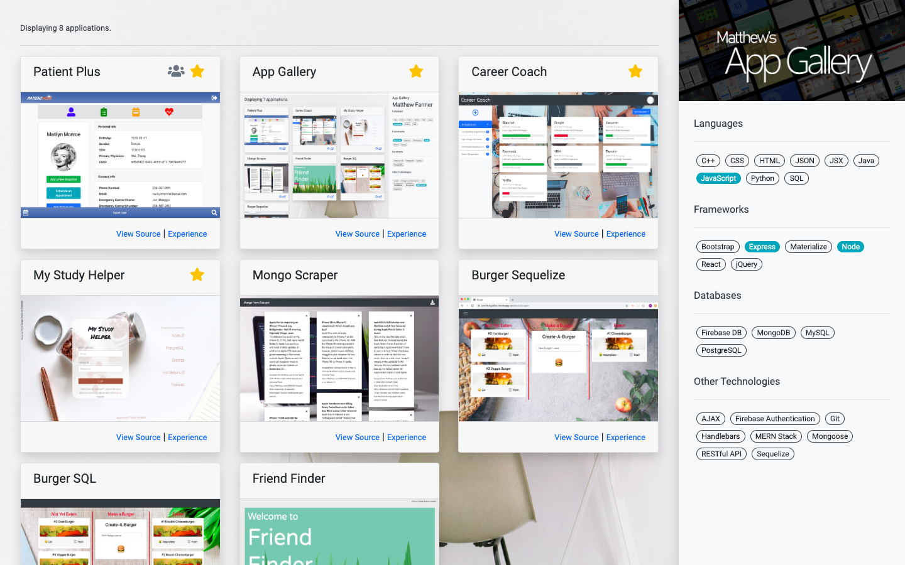

# **App Gallery**

## Credits

©2019 Matthew Farmer

## Application Link

https://mattsappgallery.herokuapp.com/

## About

A MERN-stack application designed to allow potential employers and clients to explore my full array of projects with filter-by-technology functionality (separate from my portfolio).

## Walkthrough

Upon accessing the App Gallery, users will be presented with my full array of applications with no filters applied. To filter apps that utilize certain technologies, users may select appropriate keywords from the right side of the screen. Users may also remove any applied keyword filters.

The image above is an illustration of the App Gallery. Applications are sorted by 'featured' status, then by 'collaboration' status, then by the date on which the applications were completed. Results with a 'star' icon in the top right corner are featued applications while results with a 'team' icon in the top right corner are collaborative works.

## Technologies Used

This application is built on NodeJS and hosted via Heroku. The following is a list of utilized technologies:

- MERN Stack
- React
- Node
- MongoDB
- Express
- Animate.css
- Bootstrap
- Mongoose
- Heroku
